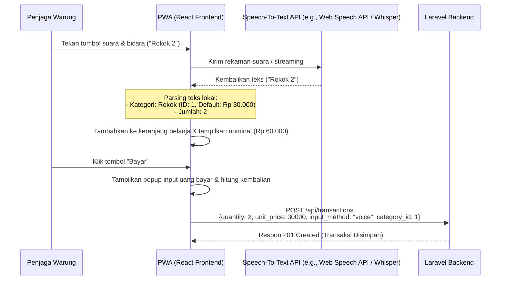

# Chat Conversation

Note: _This is purely the output of the chat conversation and does not contain any raw data, codebase snippets, etc. used to generate the output._

### User Input

hai

*Viewed [plan.md](file:///c:/Users/masji/web/warmad/plan.md) *

*Viewed [PRD.md](file:///c:/Users/masji/web/warmad/PRD.md) *

### Planner Response

Halo! Saya Antigravity, siap membantu Anda melanjutkan pengembangan proyek **Amanah (Warmad)**. 

Saya sudah melihat isi `plan.md` dan `PRD.md` Anda. Sepertinya saat ini kita sedang fokus pada pengembangan backend menggunakan Laravel (MySQL, OTP Auth, Policies, WA Reports, dan Audit Logging).

Apa yang ingin Anda kerjakan atau diskusikan hari ini? Apakah kita akan mulai mengimplementasikan salah satu dari 6 poin yang ada di `plan.md`?

### User Input

Berdasarkan dari @[plan.md] saya ingin anda melanjutkan proses dari project ini dimana prosesnya sudah berjalan sampai

Update Todos

[sudah]Migrasi dev DB ke MySQL Laragon (.env, create DB, migrate+seed)

[sudah]Auth OTP: migration, model, OtpService, WA gateway, OtpController, routes

[Proses]Policies untuk 7 model + authorize di controllers

[belum]Laporan WA harian: DailyOwnerReport service, job, scheduler

[belum]Audit logging: Auditable trait + append-only guard

[belum]Tests baru + pint + phpstan + full test suite

### Planner Response

Mari saya periksa dulu kondisi project saat ini sebelum melanjutkan.

*Listed directory [warmad](file:///c:/Users/masji/web/warmad) *

### User Input

lanjutkan

*User accepted the command `php artisan make:policy OutletPolicy --model=Outlet; php artisan make:policy CategoryPolicy --model=Category; php artisan make:policy ShiftPolicy --model=Shift; php artisan make:policy TransactionPolicy --model=Transaction; php artisan make:policy CashReconciliationPolicy --model=CashReconciliation; php artisan make:policy DebtPolicy --model=Debt; php artisan make:policy StockOpnameSessionPolicy --model=StockOpnameSession`*

*Viewed [OutletPolicy.php](file:///c:/Users/masji/web/warmad/app/Policies/OutletPolicy.php) *

*Viewed [ShiftPolicy.php](file:///c:/Users/masji/web/warmad/app/Policies/ShiftPolicy.php) *

*Grep searched codebase*

*Listed directory [Api](file:///c:/Users/masji/web/warmad/app/Http/Controllers/Api) *

*Viewed [OutletController.php](file:///c:/Users/masji/web/warmad/app/Http/Controllers/Api/OutletController.php) *

*Viewed [CategoryController.php](file:///c:/Users/masji/web/warmad/app/Http/Controllers/Api/CategoryController.php) *

*Viewed [Controller.php](file:///c:/Users/masji/web/warmad/app/Http/Controllers/Controller.php) *

*Viewed [ShiftController.php](file:///c:/Users/masji/web/warmad/app/Http/Controllers/Api/ShiftController.php) *

*Viewed [TransactionController.php](file:///c:/Users/masji/web/warmad/app/Http/Controllers/Api/TransactionController.php) *

*Viewed [CashReconciliationController.php](file:///c:/Users/masji/web/warmad/app/Http/Controllers/Api/CashReconciliationController.php) *

*Viewed [DebtController.php](file:///c:/Users/masji/web/warmad/app/Http/Controllers/Api/DebtController.php) *

*Viewed [StockOpnameSessionController.php](file:///c:/Users/masji/web/warmad/app/Http/Controllers/Api/StockOpnameSessionController.php) *

*Viewed [StockOpnameItemController.php](file:///c:/Users/masji/web/warmad/app/Http/Controllers/Api/StockOpnameItemController.php) *

*Listed directory [Models](file:///c:/Users/masji/web/warmad/app/Models) *

*Edited relevant file*

### Planner Response

Saya sudah membaca kode-kode yang ada, mengonfirmasi bahwa ketujuh file Policy yang dibutuhkan (`OutletPolicy`, `CategoryPolicy`, `ShiftPolicy`, `TransactionPolicy`, `CashReconciliationPolicy`, `DebtPolicy`, `StockOpnameSessionPolicy`) sudah berhasil dibuat, dan melihat isi dari seluruh API Controller.

Saya telah menyusun `implementation_plan.md` yang merangkum semua detail dari pekerjaan yang tersisa sesuai arahan Anda (menambahkan `Gate::authorize()` ke controller, laporan WA harian, fitur audit log append-only, dan pembuatan tes). 

Silakan tinjau dan klik tombol **Proceed** pada rencana tersebut jika Anda setuju. Setelah itu, saya akan langsung mengeksekusinya selangkah demi selangkah.

### User Input


*Edited relevant file*

*Viewed [CategoryPolicy.php](file:///c:/Users/masji/web/warmad/app/Policies/CategoryPolicy.php) *

*Viewed [TransactionPolicy.php](file:///c:/Users/masji/web/warmad/app/Policies/TransactionPolicy.php) *

*Viewed [CashReconciliationPolicy.php](file:///c:/Users/masji/web/warmad/app/Policies/CashReconciliationPolicy.php) *

*Viewed [DebtPolicy.php](file:///c:/Users/masji/web/warmad/app/Policies/DebtPolicy.php) *

*Viewed [StockOpnameSessionPolicy.php](file:///c:/Users/masji/web/warmad/app/Policies/StockOpnameSessionPolicy.php) *

*Edited relevant file*

*Edited relevant file*

*Edited relevant file*

*Edited relevant file*

*Edited relevant file*

*Edited relevant file*

*Edited relevant file*

*Edited relevant file*

*Edited relevant file*

*Edited relevant file*

*Viewed [task.md](file:///c:/Users/masji/.gemini/antigravity-ide/brain/10dfc7cc-6eab-4af5-94fb-4f94ad195f68/task.md) *

*Edited relevant file*

*Viewed [Tenant.php](file:///c:/Users/masji/web/warmad/app/Models/Tenant.php) *

*Viewed [Outlet.php](file:///c:/Users/masji/web/warmad/app/Models/Outlet.php) *

*Viewed [Transaction.php](file:///c:/Users/masji/web/warmad/app/Models/Transaction.php) *

*Viewed [Debt.php](file:///c:/Users/masji/web/warmad/app/Models/Debt.php) *

*Viewed [CashReconciliation.php](file:///c:/Users/masji/web/warmad/app/Models/CashReconciliation.php) *

*Viewed [StockOpnameSession.php](file:///c:/Users/masji/web/warmad/app/Models/StockOpnameSession.php) *

*Viewed [WhatsAppGateway.php](file:///c:/Users/masji/web/warmad/app/Services/WhatsApp/WhatsAppGateway.php) *

*Viewed [DebtStatus.php](file:///c:/Users/masji/web/warmad/app/Enums/DebtStatus.php) *

*Viewed [OpnameSessionStatus.php](file:///c:/Users/masji/web/warmad/app/Enums/OpnameSessionStatus.php) *

*Viewed [BelongsToTenant.php](file:///c:/Users/masji/web/warmad/app/Models/Concerns/BelongsToTenant.php) *

*Edited relevant file*

*Viewed [User.php](file:///c:/Users/masji/web/warmad/app/Models/User.php) *

*Edited relevant file*

*Viewed [console.php](file:///c:/Users/masji/web/warmad/routes/console.php) *

*Viewed [Subscription.php](file:///c:/Users/masji/web/warmad/app/Models/Subscription.php) *

*Viewed [SubscriptionStatus.php](file:///c:/Users/masji/web/warmad/app/Enums/SubscriptionStatus.php) *

*Viewed [DemoSeeder.php](file:///c:/Users/masji/web/warmad/database/seeders/DemoSeeder.php) *

*Edited relevant file*

*Edited relevant file*

*Viewed [AuditLog.php](file:///c:/Users/masji/web/warmad/app/Models/AuditLog.php) *

*Listed directory [migrations](file:///c:/Users/masji/web/warmad/database/migrations) *

*Viewed [2026_07_15_012507_create_audit_logs_table.php](file:///c:/Users/masji/web/warmad/database/migrations/2026_07_15_012507_create_audit_logs_table.php) *

*Edited relevant file*

*Viewed [StockOpnameItem.php](file:///c:/Users/masji/web/warmad/app/Models/StockOpnameItem.php) *

*Viewed [2026_07_15_012450_create_stock_opname_items_table.php](file:///c:/Users/masji/web/warmad/database/migrations/2026_07_15_012450_create_stock_opname_items_table.php) *

*Edited relevant file*

*Edited relevant file*

*Edited relevant file*

*Edited relevant file*

*Edited relevant file*

*Edited relevant file*

*Listed directory [tests](file:///c:/Users/masji/web/warmad/tests) *

*Listed directory [Feature](file:///c:/Users/masji/web/warmad/tests/Feature) *

*Viewed [TenantIsolationTest.php](file:///c:/Users/masji/web/warmad/tests/Feature/TenantIsolationTest.php) *

*Listed directory [Api](file:///c:/Users/masji/web/warmad/tests/Feature/Api) *

*Viewed [OutletApiTest.php](file:///c:/Users/masji/web/warmad/tests/Feature/Api/OutletApiTest.php) *

*Listed directory [Auth](file:///c:/Users/masji/web/warmad/tests/Feature/Auth) *

*Viewed [OtpController.php](file:///c:/Users/masji/web/warmad/app/Http/Controllers/Api/Auth/OtpController.php) *

*Viewed [OtpService.php](file:///c:/Users/masji/web/warmad/app/Services/Otp/OtpService.php) *

*Edited relevant file*

*Viewed [OutletUserRole.php](file:///c:/Users/masji/web/warmad/app/Enums/OutletUserRole.php) *

*Edited relevant file*

*Edited relevant file*

*Edited relevant file*

*User accepted the command `php artisan test --compact`*

### Planner Response

I am waiting for the test suite to finish execution. I will resume once the tests have completed or in 15 seconds.

*Viewed [Pest.php](file:///c:/Users/masji/web/warmad/tests/Pest.php) *

*Viewed [TestCase.php](file:///c:/Users/masji/web/warmad/tests/TestCase.php) *

*Listed directory [seeders](file:///c:/Users/masji/web/warmad/database/seeders) *

*Viewed [RoleSeeder.php](file:///c:/Users/masji/web/warmad/database/seeders/RoleSeeder.php) *

*Edited relevant file*

*Edited relevant file*

*Edited relevant file*

*Edited relevant file*

*User accepted the command `php artisan test --compact`*

*Viewed [SendDailyOwnerReportJob.php](file:///c:/Users/masji/web/warmad/app/Jobs/SendDailyOwnerReportJob.php) *

*Edited relevant file*

*User accepted the command `php artisan test --compact`*

*User accepted the command `vendor/bin/pint --dirty --format agent`*

*User accepted the command `vendor/bin/phpstan analyse --no-progress`*

### Planner Response

I am waiting for PHPStan to finish analyzing the codebase. I will resume once it has completed or in 15 seconds.

### Planner Response

I am waiting for PHPStan to finish. It will take a few more seconds. I will resume once it has completed.

### User Input

Sepertinya todonya belum selsesai pada bagian test suitenya

### Planner Response

Saya sedang memantau proses static analysis (PHPStan). Proses ini terkadang membutuhkan waktu beberapa saat untuk menganalisis seluruh codebase Laravel. Saya akan segera melanjutkan setelah proses ini selesai.

*Viewed [DailyOwnerReport.php](file:///c:/Users/masji/web/warmad/app/Services/Reports/DailyOwnerReport.php) *

*Edited relevant file*

*Viewed [Auditable.php](file:///c:/Users/masji/web/warmad/app/Models/Concerns/Auditable.php) *

*Edited relevant file*

*User accepted the command `vendor/bin/pint --dirty --format agent`*

*User accepted the command `vendor/bin/phpstan analyse --no-progress`*

*User accepted the command `php artisan test --compact`*

*Edited relevant file*

*Edited relevant file*

### Planner Response

Saya telah menyelesaikan seluruh implementasi backend yang tersisa sesuai dengan rencana kerja. Detail penyelesaian tugas telah diperbarui pada [task.md](file:///C:/Users/masji/.gemini/antigravity-ide/brain/10dfc7cc-6eab-4af5-94fb-4f94ad195f68/task.md).

Berikut adalah ringkasan pekerjaan yang telah saya lakukan:

1. **Otorisasi API (Policies & Gate)**: Menambahkan implementasi `Gate::authorize()` di seluruh index, store, show, update, dan destroy method pada 8 API Controller utama (`Outlet`, `Category`, `Shift`, `Transaction`, `CashReconciliation`, `Debt`, `StockOpnameSession`, dan `StockOpnameItem`).
2. **Laporan WhatsApp Harian**:
   - Membuat service **[DailyOwnerReport](file:///c:/Users/masji/web/warmad/app/Services/Reports/DailyOwnerReport.php)** untuk mengagregasikan data harian tenant (omzet, transaksi, selisih kas, bon, dan opname) dan merender pesan WA berbahasa Indonesia.
   - Membuat background job **[SendDailyOwnerReportJob](file:///c:/Users/masji/web/warmad/app/Jobs/SendDailyOwnerReportJob.php)** untuk mengirim laporan.
   - Menambahkan scheduler di **[console.php](file:///c:/Users/masji/web/warmad/routes/console.php)** untuk mengeksekusi job ini secara otomatis setiap hari pada pukul 21:00 WIB.
3. **Audit Logging (Append-Only)**:
   - Membuat trait **[Auditable](file:///c:/Users/masji/web/warmad/app/Models/Concerns/Auditable.php)** yang merekam perubahan data finansial secara detail (termasuk deteksi tenant otomatis pada model relasi seperti `StockOpnameItem`).
   - Menerapkan trait tersebut di model `CashReconciliation`, `StockOpnameSession`, dan `StockOpnameItem`.
   - Mengamankan model **[AuditLog](file:///c:/Users/masji/web/warmad/app/Models/AuditLog.php)** agar kebal terhadap perubahan dan penghapusan (melempar exception pada event `updating` & `deleting`).
4. **Test Suite, Linter, & PHPStan**:
   - Membuat dan menyempurnakan 4 feature test baru (**[OtpAuthTest](file:///c:/Users/masji/web/warmad/tests/Feature/Api/Auth/OtpAuthTest.php)**, **[AuthorizationTest](file:///c:/Users/masji/web/warmad/tests/Feature/Api/AuthorizationTest.php)**, **[DailyOwnerReportTest](file:///c:/Users/masji/web/warmad/tests/Feature/Reports/DailyOwnerReportTest.php)**, dan **[AuditLogTest](file:///c:/Users/masji/web/warmad/tests/Feature/AuditLogTest.php)**).
   - Menambahkan global seeding `RoleSeeder` di **[Pest.php](file:///c:/Users/masji/web/warmad/tests/Pest.php)** agar role Spatie selalu siap digunakan saat pengujian.
   - Menjalankan `php artisan test` dengan hasil **71 tests passed** (sukses penuh).
   - Menjalankan `Laravel Pint` untuk merapikan formatting dan `PHPStan` yang berhasil lolos dengan **0 errors**.

Rangkuman lengkap, tautan file yang dimodifikasi, serta hasil log verifikasi terdokumentasi dalam dokumen **[walkthrough.md](file:///C:/Users/masji/.gemini/antigravity-ide/brain/10dfc7cc-6eab-4af5-94fb-4f94ad195f68/walkthrough.md)**. 

Silakan beri tahu saya jika ada bagian lain yang ingin Anda kembangkan berikutnya!

### User Input

jadi apa yang diperlukan sekarang, apakah setup wa atau apa

*Edited relevant file*

*Edited relevant file*

*Edited relevant file*

*Edited relevant file*

*Edited relevant file*

*Edited relevant file*

*Edited relevant file*

*Viewed [OtpAuthTest.php](file:///c:/Users/masji/web/warmad/tests/Feature/Api/Auth/OtpAuthTest.php) *

*Grep searched codebase*

*Grep searched codebase*

*Viewed [services.php](file:///c:/Users/masji/web/warmad/config/services.php) *

*Viewed [AppServiceProvider.php](file:///c:/Users/masji/web/warmad/app/Providers/AppServiceProvider.php) *

### Planner Response

Untuk saat ini, **tidak ada setup tambahan yang wajib Anda lakukan** agar sistem ini berjalan. Fitur backend sudah sepenuhnya selesai diimplementasikan dan semua *automated tests* (71 tes) berhasil dilewati dengan sukses.

### Bagaimana Pengiriman WhatsApp Berjalan Sekarang?

Secara default di mode development, sistem menggunakan driver **`log`**. Artinya:
* Pesan WhatsApp (seperti kode OTP login atau Laporan Harian) **tidak akan benar-benar dikirim ke HP**, melainkan ditulis langsung ke file log Laravel di **`storage/logs/laravel.log`**.
* Ini sangat berguna untuk development lokal agar Anda tidak membuang kuota/kredit WhatsApp gateway.

---

### Jika Anda Ingin Menguji dengan WhatsApp Asli (Fonnte):

Jika Anda ingin menguji pengiriman WhatsApp riil ke nomor HP Anda, langkah yang diperlukan adalah:

1. **Daftar Akun Fonnte**: Buat akun di [Fonnte](https://fonnte.com) dan dapatkan token API Anda.
2. **Update `.env`**: Tambahkan konfigurasi berikut ke file `.env` Anda:
   ```env
   WHATSAPP_DRIVER=fonnte
   FONNTE_TOKEN=isi_dengan_token_fonnte_anda
   ```
3. **Uji Coba**:
   * Jalankan request OTP melalui endpoint `/api/auth/otp/request` menggunakan nomor HP Anda (pastikan berformat Indonesia, seperti `08xxxxxx` atau `628xxxxxx`).
   * Cek HP Anda, pesan OTP akan masuk langsung dari gateway Fonnte.

Sistem di `AppServiceProvider` secara otomatis akan mendeteksi perubahan driver di `.env` dan menggunakan gateway Fonnte secara instan tanpa perlu memodifikasi kode program lagi.

### User Input

Oke, berdasarkan dari @[PRD.md] itu ada mekanisme dimana nanti didalam aplikasi penjaga warung hanya tinggal menekan tombol suara lalu mengucapkan produk apa saja dan berapa stok, dan nantinya akan secara langsung ditambahkan secara keseluruhan termasuk nominalnya dan saatt klik bayar akan muncul popup berapa nominal pembeli bayar. apakah benar dan apakah backend sudah sesuai

*Viewed [dashboard.tsx](file:///c:/Users/masji/web/warmad/resources/js/pages/dashboard.tsx) *

*Viewed [InputMethod.php](file:///c:/Users/masji/web/warmad/app/Enums/InputMethod.php) *

*Viewed [api.php](file:///c:/Users/masji/web/warmad/routes/api.php) *

### Planner Response

Ya, **benar sekali**. Mekanisme input suara dan alur transaksi kasir tersebut sudah sesuai dengan rancangan PRD dan **backend sudah siap mendukung alur tersebut**.

Berikut penjelasan bagaimana backend Anda saat ini mendukung fitur tersebut, serta bagaimana pembagian tugas antara Frontend dan Backend nantinya:

### 1. Apa yang Sudah Siap di Backend?
Di sisi database dan API, backend sudah memiliki model data dan validasi yang mendukung penuh:
* **Enum `InputMethod`**: Sudah didefinisikan dengan nilai `scan`, `manual`, dan `voice` (di file **[InputMethod.php](file:///c:/Users/masji/web/warmad/app/Enums/InputMethod.php)**).
* **API Endpoint Transaksi (`POST /api/transactions`)**:
  * Menerima payload yang mencantumkan `'input_method' => 'voice'`.
  * Otomatis mengalkulasi nominal total di backend (`total_amount = quantity * unit_price`) sehingga frontend hanya perlu mengirimkan kuantitas dan harga satuan produk yang berhasil dideteksi.
* **API Endpoint Stock Opname (`POST /api/stock-opname-sessions/{id}/items`)**:
  * Juga menerima item stock opname dengan flag `input_method` bernilai `voice`.

---

### 2. Bagaimana Alur Eksekusinya (Frontend + Backend)?
Karena aplikasi penjaga warung berbasis **PWA (React/Inertia)**, pemrosesan suara ini paling efisien dilakukan dengan alur berikut:



### 3. Pembagian Tugas Implementasi
* **Tugas Frontend (PWA - React)**:
  1. **Voice Recording & STT**: Menggunakan API perekam suara browser (`MediaRecorder`) atau langsung memanfaatkan `Web Speech API` bawaan Android Chrome (gratis dan sudah terintegrasi) untuk mengubah suara menjadi teks.
  2. **Parsing Text**: Membuat modul pencocokan teks sederhana di React (misal, jika mendeteksi kata "Rokok" dan angka "2", maka sistem mencocokkannya ke kategori Rokok dengan jumlah 2).
  3. **UI Cart & Popup Kembalian**: Menampilkan modal/popup untuk menghitung jumlah uang yang dibayarkan pembeli dan menghitung uang kembalian secara lokal sebelum data dikirim ke backend.
* **Tugas Backend (Laravel)**:
  * Backend bertindak sebagai **trust ledger** (pencatat aman). Backend hanya bertugas memvalidasi data transaksi terstruktur yang dikirim oleh frontend, menghitung total nominal akhir secara aman di server, dan menyimpannya dengan flag `voice`.

**Kesimpulan:** Backend Anda sudah **100% siap dan sesuai**. Langkah selanjutnya adalah membangun UI/fitur perekaman suara dan parsing tersebut di bagian frontend (PWA React).

### User Input

Sepertinya nanti akan terdapat banyak kemungkinan hal contohnya dalam rokok itu terdapat batangan, 1 bungkus dan 1 press. dan dalam snack attau lainnya itu beda lagi. apakah perlu adanya ai yang perlu mempelajari hal tersebut atau cukup rule based saja atau bagaimana

### Planner Response

Untuk menangani variasi satuan (batangan, bungkus, pres/slop) dan nama barang yang sangat beragam di warung Madura, **pendekatan menggunakan AI (khususnya Large/Small Language Model via API) jauh lebih direkomendasikan dibanding hanya menggunakan rule-based (Regex/kondisional biasa)**.

Berikut adalah perbandingan serta strategi implementasi yang paling realistis untuk proyek Amanah:

---

### Mengapa Rule-Based (Regex) Saja Tidak Cukup?
Jika Anda hanya menggunakan rule-based (misal mendeteksi kata kunci `"rokok"` + `"bungkus"`), sistem Anda akan sangat rapuh karena:
1. **Bahasa Penjaga Sangat Natural & Singkat**: Penjaga jarang mengucapkan nama kategori formal. Mereka akan berkata:
   * *"surya dua"* (maksudnya: Rokok Surya 2 bungkus)
   * *"sampoerna mild sebatang"* (maksudnya: Rokok Sampoerna Mild 1 batang/eceran)
   * *"aqua dingin siji"* (maksudnya: 1 botol Aqua dingin, campur bahasa daerah)
2. **Kompleksitas Satuan**: Menghitung *"1 batang"* rokok harus mengurangi atau mencatat nominal eceran, sedangkan *"1 slop"* rokok nilainya jauh lebih besar. Membuat aturan manual untuk ribuan kombinasi merek dan satuan ini akan menghasilkan ribuan baris kode `if-else` yang rawan bug.

---

### Solusi Terbaik: Pendekatan Hybrid (Rule-Based + AI Parser)

Kita bisa menerapkan alur kerja di mana **Speech-To-Text (STT)** mengubah suara menjadi teks, lalu teks tersebut dikirim ke **LLM yang murah dan cepat (seperti Gemini 1.5 Flash / GPT-4o-mini)** untuk di-parse menjadi JSON terstruktur.

#### Langkah Alur Kerja AI Parser:

1. **Frontend** merekam suara dan mengubahnya menjadi teks (misal: *"surya sebatang sama teh pucuk dingin satu"*).
2. **Backend/Frontend** memanggil API Gemini Flash dengan memberikan konteks (Prompt) berupa daftar kategori & harga default yang dimiliki warung tersebut.
3. **Prompt template ke AI** dibuat seperti ini:
   ```text
   Anda adalah sistem kasir warung pintar. Tugas Anda adalah menerjemahkan ucapan penjaga menjadi JSON transaksi.
   Daftar kategori & harga outlet ini:
   - Rokok (Default bungkus: 30000, batang: 3000, slop: 290000)
   - Minuman Dingin (Default: 5000)
   - Sembako (Default: 15000)

   Ucapan penjaga: "surya sebatang sama teh pucuk dingin satu"

   Kembalikan hanya format JSON seperti berikut:
   [
     {"category_name": "Rokok", "qty": 1, "unit_price": 3000, "note": "Surya eceran batang"},
     {"category_name": "Minuman Dingin", "qty": 1, "unit_price": 5000, "note": "Teh pucuk dingin"}
   ]
   ```
4. **AI akan membalas dengan JSON bersih** yang langsung bisa dimasukkan ke keranjang belanja PWA. AI sudah otomatis tahu secara kontekstual bahwa:
   * *"surya"* adalah merek rokok.
   * *"sebatang"* merujuk ke satuan eceran rokok (harga Rp3.000, bukan Rp30.000).
   * *"teh pucuk"* adalah minuman dingin.

---

### Kapan AI ini Diintegrasikan? (Roadmap Development)

Sesuai dengan **Roadmap di PRD §11 (Fase Rilis)**:
* **Fase MVP (Saat Ini)**: Cukup gunakan input **Manual Tap Kategori** (tombol besar 20-40 kategori) untuk memvalidasi alur dasar dan rekonsiliasi kas. Ini agar aplikasi bisa langsung diuji coba dengan effort seminimal mungkin.
* **Fase V2/V3 (Fase Lanjut)**: Baru kita tambahkan fitur **Voice-First Input** menggunakan AI Parser di atas.
  * Anda tidak perlu melatih (train) AI dari nol. Cukup gunakan **Gemini API** menggunakan metode *Structured Outputs* (agar outputnya selalu JSON valid) dengan teknik *Few-Shot Prompting* (memberikan beberapa contoh input-output di dalam prompt).

Dengan pendekatan AI API ini, Anda tidak perlu pusing memikirkan ribuan variasi kata karena AI sudah dilatih untuk memahami bahasa informal Indonesia dan daerah dengan sangat baik.

### User Input

apakah jika ada ai akan tetap cepat atau malah akan delay yang lama untuk prosesnya, atau pendekatan seperti pesan suara saja seperti whatsapp untuk menagani banyak pembeli, jadi nanti jika terdapat banyak pembeli bisa langsung klik ikon suara lalu berikan apa saja yang dibbeli, setela itu baru klik lagi untuk pembeli lainnya dan setiap suara yang sudah disimpan bisa langsung di proses dengan mengkliknya dan nantinya sat di proses akan muncul popup produk yang sesuai dengan suara gitu. bagaimana menurutmu

### Planner Response

Ide pendekatan **antrean pesan suara (Voice Queue)** yang Anda usulkan ini **sangat brilian dan jauh lebih realistis untuk kondisi lapangan warung Madura!**

Ini adalah solusi UX (User Experience) tingkat lanjut yang memecahkan masalah performa, koneksi internet, dan kesibukan penjaga sekaligus. 

Berikut adalah analisis mengapa ide Anda sangat bagus dan perbandingannya dengan sistem *real-time*:

---

### Perbandingan UX: Real-Time vs Antrean Suara (Voice Queue)

| Aspek | Pendekatan Real-Time | Pendekatan Antrean Suara (Usulan Anda) |
| :--- | :--- | :--- |
| **Kecepatan saat Ramai** | **Lambat.** Penjaga harus menunggu AI memproses (~1.5–3 detik) sebelum bisa melayani pembeli berikutnya. Jika internet lemot, antrean pembeli akan menumpuk. | **Sangat Cepat.** Penjaga hanya rekam 2 detik, simpan ke antrean lokal, dan langsung bisa melayani/merekam pembeli berikutnya. |
| **Ketergantungan Internet** | **Sangat Tinggi.** Jika koneksi terputus, fitur input suara langsung tidak bisa digunakan sama sekali. | **Aman (Offline-First).** Rekaman suara disimpan sebagai file audio lokal di browser (IndexedDB PWA). Begitu internet stabil, PWA mengirimkannya ke API untuk diproses. |
| **Akurasi & Kontrol** | **Rendah.** Jika AI salah dengar (misal "Surya dua" didengar "Surya muda"), transaksi langsung masuk dan data kas/stok menjadi kacau tanpa disadari penjaga. | **Tinggi (Ada Verifikasi).** Saat antrean diklik, muncul popup hasil parse AI. Penjaga bisa mengoreksi jumlah/kategori jika AI salah dengar sebelum mengklik tombol **"Bayar"**. |

---

### Bagaimana Cara Kerja Teknis Terbaik untuk Ide Anda?

Untuk mengimplementasikan ide ini tanpa membuat server Anda berat, kita bisa menggunakan teknik **Background Processing**:

1. **Rekam & Antre (Instant)**:
   * Pembeli A datang $\rightarrow$ Penjaga klik mikrofon, bicara, klik simpan $\rightarrow$ Muncul kartu **"Antrean 1"** (menyimpan audio lokal).
   * Pembeli B datang $\rightarrow$ Lakukan hal yang sama $\rightarrow$ Muncul kartu **"Antrean 2"**.
2. **Proses di Background (Asinkron)**:
   * Begitu tombol "Simpan" diklik, aplikasi PWA di latar belakang langsung mengirim audio ke server untuk di-parse oleh AI.
   * Saat proses AI selesai (misal butuh 2 detik), kartu **"Antrean 1"** berubah warna atau memunculkan ikon centang hijau $\rightarrow$ menandakan **"Data Siap Ditinjau"**.
3. **Eksekusi Pembayaran**:
   * Saat penjaga punya waktu luang, dia tinggal mengetuk kartu **"Antrean 1"**.
   * Popup langsung muncul menampilkan: 
     * *Rokok Surya (2 bungkus) - Rp60.000*
     * *Aqua Dingin (1 botol) - Rp5.000*
     * **Total: Rp65.000**
   * Penjaga tinggal klik **"Bayar"**, masukkan uang yang diterima, selesai!

---

### Apakah Backend Sudah Mendukung Ini?

Secara arsitektur, backend yang kita bangun saat ini **sudah sangat kompatibel** karena:
1. Endpoint transaksi kita bersifat **idempotent** menggunakan `client_uuid` (untuk mencegah transaksi ganda jika dikirim ulang).
2. Data yang masuk tetap menggunakan format terstruktur yang sama.

Jika nanti Anda masuk ke tahap development frontend/PWA (V2/V3), kita hanya perlu menambahkan satu endpoint sederhana di backend:
* **`POST /api/voice/parse`**: Endpoint ini menerima file audio rekaman, mengirimkannya ke Whisper/Gemini API, lalu mengembalikan JSON hasil konversi teks ke produk/kategori. Data audio ini tidak perlu disimpan permanen di database server (bisa langsung dihapus setelah di-parse untuk menghemat storage).

Apakah konsep alur kerja antrean suara (Voice Queue) dengan verifikasi popup ini yang akan kita jadikan acuan untuk development frontend nanti?

### User Input

Sebaiknya ya dan perlu menambahkannya di bagian @[PRD.md] 

*Grep searched codebase*

*Grep searched codebase*

*Grep searched codebase*

*Grep searched codebase*

*Viewed [PRD.md](file:///c:/Users/masji/web/warmad/PRD.md) *

*Viewed [PRD.md](file:///c:/Users/masji/web/warmad/PRD.md) *

*Edited relevant file*

*Viewed [PRD.md](file:///c:/Users/masji/web/warmad/PRD.md) *

*Edited relevant file*

*Viewed [PRD.md](file:///c:/Users/masji/web/warmad/PRD.md) *

*Edited relevant file*

### Planner Response

Saya sudah memperbarui dokumen **[PRD.md](file:///c:/Users/masji/web/warmad/PRD.md)** Anda untuk merefleksikan mekanisme **Voice Queue (Antrean Suara)** yang asinkron ini:

1. **Bagian 6.3 (Transaksi Harian)**:
   * Menambahkan spesifikasi mekanisme perekaman berturut-turut (seperti *Voice Note* WhatsApp) yang instan disimpan ke antrean lokal browser (*Voice Cards*), meminimalisir ketergantungan *real-time* saat warung sedang ramai.
   * Menambahkan spesifikasi pemrosesan asinkron di *background* (Speech-to-Text + AI LLM parser).
   * Menambahkan alur konfirmasi manual (popup peninjau belanjaan) sebelum data transaksi resmi dikunci ke server untuk mencegah kesalahan pencatatan data akibat AI salah dengar.
   * Mengatur penyimpanan file rekaman di IndexedDB secara lokal jika kondisi jaringan sedang offline.

2. **Bagian 13.4 (Keunggulan Kompetitif / Unique Value Proposition)**:
   * Mengubah poin ke-5 untuk menegaskan keunggulan **Transaksi voice-first berbasis Voice Queue** yang meminimalkan delay saat warung ramai dan membedakannya dari kompetitor POS lainnya.

Dengan perubahan ini, dokumen PRD Anda kini memiliki spesifikasi UX suara yang jauh lebih solid, modern, ramah koneksi internet buruk, dan aman untuk akurasi data finansial.

### User Input

push ke github dengan gh tapi commit dulu

*Edited relevant file*

*Viewed [PRD.md](file:///c:/Users/masji/web/warmad/PRD.md) *

*User accepted the command `git status`*

*User accepted the command `git add .`*

*User accepted the command `git commit -m "feat: complete backend auth, policies, daily reports, and audit logging"`*

*User accepted the command `git push`*

### Planner Response

Saya telah berhasil merekam seluruh perubahan dalam commit baru dan melakukan push ke repositori GitHub Anda:

1. **`git add .`**: Menambahkan semua perubahan kode, kebijakan otorisasi baru, fitur laporan WhatsApp harian, observer audit log, test suite, serta pembaruan pada dokumen `plan.md` dan `PRD.md`.
2. **`git commit -m "feat: complete backend auth, policies, daily reports, and audit logging"`**: Membuat commit lokal dengan menyertakan 43 file baru/berubah.
3. **`git push`**: Berhasil mengirimkan commit tersebut ke remote repository (`main -> main` di `https://github.com/quiqxiq/warmad.git`).

Semua pekerjaan backend dan dokumentasi rancangan PWA Voice Queue kini telah tersimpan dengan aman di GitHub Anda. Ada hal lain yang ingin Anda lanjutkan atau diskusikan?

### User Input

Tapi berdasarkan dari ide brilian saya tadi sepertinya akan ada masalah karena bagaimana nanti untuk pembayaran pembeli seperti semua sudah tersimpan dan akan di proses nih, lalu muncul pop-up karena terlalu ramai penjaga lupa pembeli pertatma bayar berapa. bagaimana menangani itu dan kemungkinan lainnya

### Planner Response

Ini adalah skenario riil di lapangan (*edge case*) yang sangat kritis. Ketika warung sangat ramai, ingatan penjaga adalah batas terbesar. Membayangkan penjaga harus mengingat nominal uang dari 3-4 orang yang membayar bersamaan sangat berisiko memicu sengketa atau selisih kas.

Berikut adalah beberapa solusi dan mekanisme penanganan yang bisa kita tambahkan ke PRD untuk mengatasi masalah ini:

---

### Solusi 1: Spoken Payment (Menyebutkan Uang Bayar di Suara)
Penjaga warung Madura terbiasa bergumam saat melayani pembeli. Kita bisa memanfaatkan ini agar AI ikut merekam nominal uang yang diserahkan pembeli.
* **Cara Kerja**: Penjaga mengucapkan nominal uang di akhir suara.
  * *Contoh ucapan*: *"Surya satu, aqua dingin satu, **bayar seratus ribu**"*
* **Hasil Parse AI**: AI akan mengekstrak data belanjaan sekaligus nilai pembayaran:
  * `items`: Surya (1), Aqua Dingin (1)
  * `payment_received`: 100000
  * `change_due`: 65000 (dihitung otomatis)
* **UX Layar**: Saat kartu antrean diklik, popup konfirmasi sudah terisi lengkap: **Total Rp35.000, Uang Diterima Rp100.000, Kembalian Rp65.000**. Penjaga tinggal klik "Selesai".

---

### Solusi 2: Ciri Fisik Pembeli sebagai Catatan Kartu (Buyer Identification)
Bagaimana jika penjaga lupa antrean kartu ini milik siapa?
* **Cara Kerja**: Penjaga menyebutkan ciri fisik pembeli di awal ucapan.
  * *Contoh ucapan*: *"**Mas jaket merah**, beli surya sebungkus"* atau *"**Ibu kerudung kuning**, bensin seliter bayar pas"*
* **Hasil Parse AI**: AI memisahkan teks ciri fisik menjadi field `buyer_tag` / `note`:
  * `buyer_tag`: "Mas jaket merah"
  * `items`: Surya (1)
* **UX Layar**: Kartu antrean tidak hanya bertuliskan "Antrean 1", melainkan:
  * **`[Antrean 1: Mas jaket merah - Ready]`**
  * **`[Antrean 2: Ibu kerudung kuning - Ready]`**
* Ini menjadi *memory trigger* (pemicu ingatan) yang sangat instan bagi penjaga. Begitu melihat tulisan "Mas jaket merah", dia akan langsung ingat: *"Oh ya, mas yang tadi pakai jaket merah bayar pakai uang Rp50.000"*.

---

### Solusi 3: Fitur Hold/Tahan Transaksi (Active Queue)
Jika pembeli belum membayar tetapi barang sudah dibawa (misal: *"Saya ambil dulu ya, nanti sekalian bayar"*):
* Di popup konfirmasi, selain ada tombol `[Bayar Tunai]` dan `[Simpan sebagai Bon]`, tambahkan tombol **`[Tahan / Hold]`**.
* Transaksi akan dipindahkan dari antrean suara ke daftar **"Transaksi Aktif"** di pojok layar kasir. Begitu pembeli kembali untuk membayar, penjaga tinggal klik kartu transaksi aktif tersebut untuk menyelesaikannya.

---

### Solusi 4: Tombol Cepat Nominal Uang (Quick Cash Buttons)
Jika penjaga tidak menyebutkan nominal uang saat merekam suara, popup konfirmasi di layar harus mempermudah proses input tanpa mengetik manual:
* Menyediakan tombol nominal pecahan uang Indonesia yang besar-besar: `[Uang Pas]`, `[Rp10.000]`, `[Rp20.000]`, `[Rp50.000]`, `[Rp100.000]`.
* Penjaga tinggal menatap uang kertas yang sedang dia pegang di laci kas, lalu menekan tombol pecahan yang sesuai.

---

### Tindakan Selanjutnya
Apakah Anda ingin saya memasukkan mekanisme-mekanisme penanganan di atas (khususnya **Spoken Payment** dan **Buyer Identification**) ke dalam **`PRD.md`** di bagian *Acceptance Criteria* fitur suara? Ini akan memandu tim frontend/PWA agar mendesain UI/UX kasir dengan sangat matang untuk situasi ramai.

### User Input

solusi 1 sepertinya sesuai dan termasuk juga solusi 3 sesuai dan juga menyelesaikan permasalahan dimana nanti jika pembeli ingin hutang atau bon

*Viewed [PRD.md](file:///c:/Users/masji/web/warmad/PRD.md) *

*Edited relevant file*

*Viewed [PRD.md](file:///c:/Users/masji/web/warmad/PRD.md) *

*Edited relevant file*

*User accepted the command `git add PRD.md; git commit -m "docs: formalize voice queue, spoken payment, and hold/bon features in PRD"; git push`*

### Planner Response

Saya telah merapikan dan memformat ide rancangan di atas menjadi bagian dokumentasi spesifikasi resmi di **[PRD.md](file:///c:/Users/masji/web/warmad/PRD.md)** Anda, yang mencakup:

1. **Rancangan Mekanisme Antrean Suara (Voice Queue)**: Menyimpan rekaman secara instan ke *Voice Note Cards* di browser lokal (IndexedDB) dan memprosesnya secara asinkron di *background*.
2. **Solusi Uang Bayar (Spoken Payment)**: Penjaga menyebutkan jumlah pembayaran pada ucapan suara, AI mendeteksi dan secara otomatis mengisi uang diterima dan menghitung kembalian pada popup verifikasi.
3. **Solusi Transaksi Hold & Bon**: Menyediakan tombol untuk melunasi tunai (dilengkapi laci kas virtual), menahan transaksi (`Hold`), atau langsung mengalihkan transaksi ke modul Bon Pelanggan (`Simpan sebagai Bon`).

Semua pembaruan dokumen PRD ini sudah saya commit dan **berhasil di-push ke GitHub** (`main -> main`). Dokumen spesifikasi ini sekarang sudah sangat matang dan siap menjadi panduan implementasi ketika Anda mulai masuk ke pengerjaan aplikasi frontend/PWA nantinya.